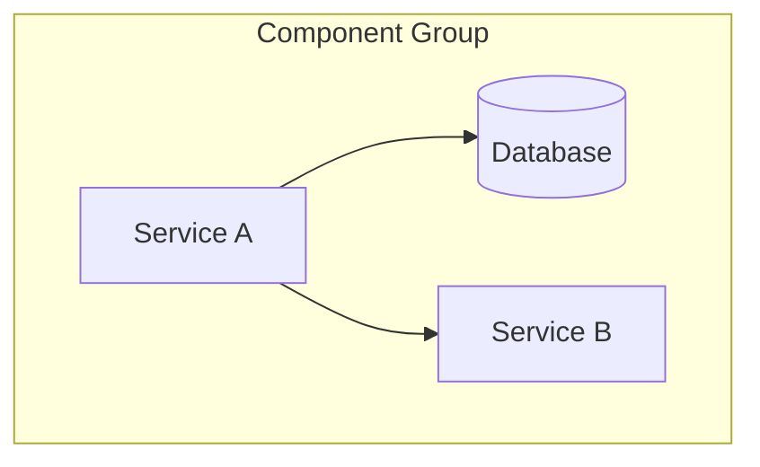
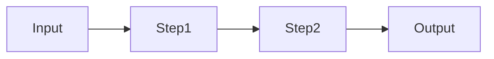
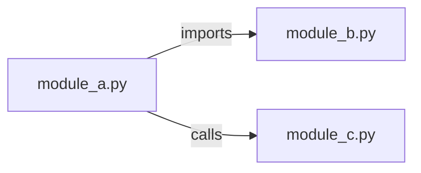
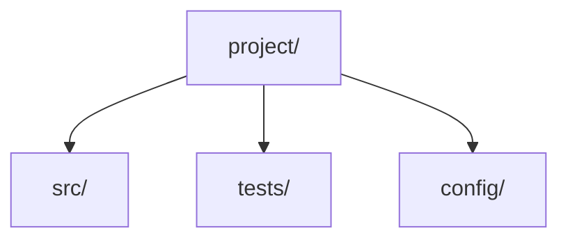

# Extract Post-Implementation Documentation from a Session

## Description

Generates comprehensive documentation from a completed implementation session. The goal is to capture everything that was built, how components relate to each other, and what decisions were made, so that future AI agents (or humans) can quickly understand the project without re-exploring the entire codebase. This saves significant context window in subsequent sessions.

## Trigger

Use this skill when the user:
- Says "document what we built", "create session docs", "extract docs from this session"
- Asks for post-implementation documentation or a session report
- Wants to capture the results of a long implementation session before ending it
- Requests architecture diagrams or component catalogs from work just completed
- Says "write it all down" or "make this understandable for next time"

## Procedure

### Critical Prerequisite

**You MUST scan the ENTIRE conversation history**, not a compressed or summarized version. Post-implementation documentation is only valuable if it captures the full scope of what happened. If you are working from a truncated context, explicitly warn the user that the documentation may be incomplete and suggest they re-run this skill in a session that has the full history.

### Phase 1 — Inventory All Artifacts

Scan the conversation from beginning to end and catalog every artifact that was created, modified, or used.

**1.1 — Code Components**
For each file created or modified, record:
- File path (absolute)
- What it does (one-line summary)
- Key functions, classes, or exports
- Language and framework
- Whether it was newly created or modified (and what changed)

**1.2 — Utilities, Tools, and Scripts**
Catalog every tool, CLI command, or script that was used during the session:
- Shell commands and their purpose
- Third-party tools installed or configured
- Scripts created for automation
- Configuration files created or modified

**1.3 — Infrastructure and Configuration**
- Docker/container configurations
- Kubernetes manifests, Helm charts
- CI/CD pipeline definitions
- Environment variables and config files
- Database schemas or migrations
- Message queue topologies

**1.4 — Design Decisions**
For each significant decision made during the session:
- What was the decision
- What alternatives were considered
- Why the chosen approach was selected
- Any trade-offs or known limitations

### Phase 2 — Map Relationships

**2.1 — Dependency Graph**
Identify how components depend on each other:
- Import/require relationships
- Service-to-service communication (HTTP, message queue, shared storage)
- Data flow: where data enters, how it transforms, where it exits
- Configuration dependencies (what needs to be set for what to work)

**2.2 — Create Mermaid Diagrams**

Generate the following diagrams using Mermaid syntax:

**Architecture Overview** — High-level system diagram showing all services, data stores, and their connections:


**Data Flow** — How data moves through the system from input to output:


**Component Relationships** — Detailed dependency diagram:


**Directory Structure** — Tree diagram of the project layout:


Adapt the diagram types and complexity to what was actually built. Omit diagram types that do not apply. Add additional diagram types if the system warrants it (e.g., sequence diagrams for complex interactions, state diagrams for lifecycle management).

### Phase 3 — Produce Documentation Package

Create the following files. Use the current date in filenames where indicated. Adjust paths if the project uses a different documentation structure.

**3.1 — Session Report: `docs/session-report-YYYY-MM-DD.md`**

Structure:
```markdown
# Session Report — YYYY-MM-DD

## Summary
One-paragraph overview of what was accomplished.

## Goals
- What the user set out to achieve
- Which goals were completed, partially completed, or deferred

## Components Created
| File | Type | Description |
|------|------|-------------|
| path/to/file.py | New | Brief description |
| path/to/other.py | Modified | What changed |

## Components Modified
| File | Change Summary |
|------|---------------|
| path/to/file | Description of changes |

## Design Decisions
| Decision | Rationale | Alternatives Considered |
|----------|-----------|------------------------|
| Choice made | Why | What else was considered |

## Tools and Commands Used
- List of significant tools, CLI commands, and scripts

## Open Items
- Anything left incomplete or flagged for follow-up
- Known issues discovered during implementation

## Next Steps
- Recommended follow-up work
```

**3.2 — Architecture Overview: `docs/architecture.md`**

Structure:
```markdown
# Architecture Overview

## System Diagram
(Mermaid architecture diagram)

## Data Flow
(Mermaid data flow diagram)

## Components
Brief description of each major component and its role.

## Communication Patterns
How components interact (API calls, message queues, shared storage, etc.)

## Infrastructure
Deployment topology, container orchestration, storage, networking.
```

If `docs/architecture.md` already exists, update it rather than overwriting. Merge new sections and preserve existing content that is still accurate.

**3.3 — Component Catalog: `docs/component-catalog.md`**

Structure:
```markdown
# Component Catalog

## Directory Structure
(Mermaid directory tree or text-based tree)

## Components

### component-name
- **Path**: absolute/path/to/component
- **Type**: service | library | script | config | chart
- **Language**: Python 3.11 | TypeScript | YAML | etc.
- **Purpose**: What it does
- **Key Files**:
  - `file.py` — description
  - `other.py` — description
- **Dependencies**: What it depends on
- **Dependents**: What depends on it
- **Configuration**: Required env vars or config files
- **Entry Point**: How to run it

(Repeat for each component)
```

**3.4 — Update Project Memory / Agent Instructions**

If the project has an `AGENT.md`, `CLAUDE.md`, or equivalent agent instruction file:
- Add or update the project structure section
- Add new file groups for components created in this session
- Update any architecture summaries
- Add new key facts or conventions established during the session

If the project uses a memory file (e.g., `.claude/` memory, `MEMORY.md`):
- Suggest specific entries to add based on what was built
- Present the suggested updates to the user for approval before writing

### Phase 4 — Review and Refine

Before presenting the final output:
1. Re-read all generated documents for internal consistency
2. Verify that every file created or modified in the session is accounted for
3. Check that all Mermaid diagrams render correctly (valid syntax)
4. Ensure no placeholder text remains (no `TODO`, `TBD`, or `<PLACEHOLDER>` markers)
5. Confirm absolute file paths are used throughout

Present the documentation to the user and ask if any sections need expansion, correction, or additional detail.

## Output

Deliver:
- `docs/session-report-YYYY-MM-DD.md` — full session report with tables and decision log
- `docs/architecture.md` — architecture overview with Mermaid diagrams (created or updated)
- `docs/component-catalog.md` — detailed inventory of all components (created or updated)
- Proposed updates to `AGENT.md`, `CLAUDE.md`, or memory files (shown to user for approval)
- A final summary listing all files created or modified by this skill, with a count of components documented
